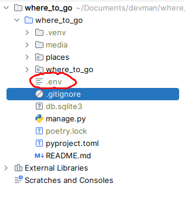
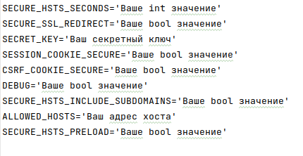

# Куда пойти — Москва

Фронтенд для будущего сайта о самых интересных местах в Москве.


[Демка сайта](./pictures_guide/site.png).

## Как запустить
* Скачайте код
* Установите зависимости в корневой директории проекта и активируйте их
```console
$ poetry install
$ poetry shell
```
* Создайте файл .env в корневой директории проекта и укажите переменные окружения



* Проведите миграции
```console
$ python manage.py makemigrations
$ python manage.py migrate
```
* Запустите сервер
```console
$ python manage.py runserver
```
