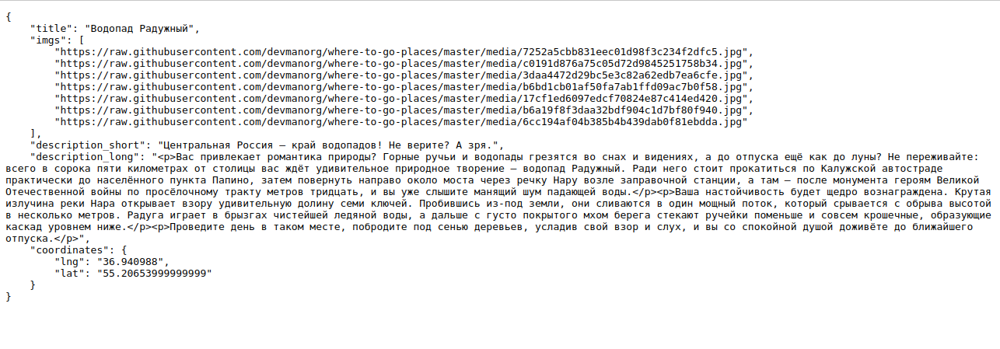

# Куда пойти — Москва

Сайт о самых интересных местах в Москве.


[Демка сайта](https://valhallajazzy.pythonanywhere.com/)  
[Админ-панель сайта](https://valhallajazzy.pythonanywhere.com/admin/)

## Как запустить
* Скачайте код
* Установите зависимости в корневой директории проекта и активируйте их
```console
$ poetry install
$ poetry shell
```
* Создайте файл .env в корневой директории проекта и укажите переменные окружения


Подробнее о переменных окружения из официальной документации:

SECURE_HSTS_SECONDS - If set to a non-zero integer value, causes SecurityMiddleware to set the HTTP Strict Transport Security header on all responses that do not already have that header.

SECURE_SSL_REDIRECT - If set to True, causes SecurityMiddleware to redirect all non-HTTPS requests to HTTPS (except for those URLs matching a regular expression listed in SECURE_REDIRECT_EXEMPT). Defaults to False.

SECRET_KEY - The Django secret key is used to provide cryptographic signing. This key is mostly used to sign session cookies. If one were to have this key, they would be able to modify the cookies sent by the application.

SESSION_COOKIE_SECURE - This setting tells Django to only send the session cookie over HTTPS connections. When set to True , the session cookie will not be sent over unencrypted HTTP connections.

CSRF_COOKIE_SECURE - Default: False. Whether to use a secure cookie for the CSRF cookie. If this is set to True, the cookie will be marked as “secure”, which means browsers may ensure that the cookie is only sent with an HTTPS connection.

DEBUG - A boolean that turns on/off debug mode. If your app raises an exception when DEBUG is True, Django will display a detailed traceback, including a lot of metadata about your environment, such as all the currently defined Django settings (from settings.py).

SECURE_HSTS_INCLUDE_SUBDOMAINS - If True, causes SecurityMiddleware to add the includeSubDomains tag to the HTTP Strict Transport Security header. Has no effect unless SECURE_HSTS_SECONDS is set to a non-zero value. Defaults to False (only for backwards compatibility; in most cases if HSTS is used it should be set to True).

ALLOWED_HOSTS - A list of strings representing the host/domain names that this Django site can serve. This is a security measure to prevent HTTP Host header attacks, which are possible even under many seemingly-safe web server configurations.

SECURE_HSTS_PRELOAD - Default: False. If True, the SecurityMiddleware adds the preload directive to the HTTP Strict Transport Security header. It has no effect unless SECURE_HSTS_SECONDS is set to a non-zero value.

* Проведите миграции
```console
$ python manage.py makemigrations
$ python manage.py migrate
```
* Запустите сервер
```console
$ python manage.py runserver
```

## Добавить локации
* В терминале пропишите команду
```console
$ python manage.py load_place "Ваш url к json файлу"
```

Пример JSON-файла

